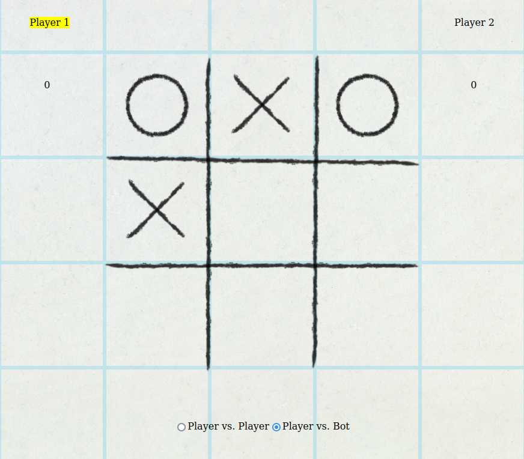

# Tic-Tac-Toe

<!-- PROJECT LOGO -->
 

<h3 align="center">Tic Tac Toe</h3>

  

Simple Tic-Tac-Toe web browser game implemented for <a href="https://www.theodinproject.com/lessons/node-path-javascript-tic-tac-toe">The Odin Project.</a>
     
    <a href="https://phammings.github.io/tic-tac-toe/">View Demo</a>
     
  

<!-- TABLE OF CONTENTS -->

  
Table of Contents

  <ol>
    <li>
      <a href="#about-the-project">About The Project</a>
      <ul>
        <li><a href="#built-with">Built With</a></li>
      </ul>
    </li>
    <li><a href="#roadmap">Roadmap</a></li>
    <li><a href="#acknowledgments">Acknowledgments</a></li>
  </ol>

<!-- ABOUT THE PROJECT -->
## About The Project

This project primarily focuses on using modules and factory functions to implement an interactive tic-tac-toe game that can be played versus another player or an AI on a web browser's DOM. An additional goal of the project was to familiarize myself with CSS animations which is heavily used in the project.

(<a href="#readme-top">back to top</a>)

### Built With

* [![Javascript][Javascript.js]][Javascript-url]
* [![HTML][HTML.html]][HTML-url]
* [![CSS][CSS.css]][CSS-url]

(<a href="#readme-top">back to top</a>)

<!-- ROADMAP -->
## Roadmap

- ✔️ Store gameboard as array inside Gameboard object
- ✔️ Object to control flow of game
- ✔️ Little global code as possible
- ✔️ Place everything inside modules and/or factory functions
- ✔️ Create an AI so player can play against the computer
    - [ ] Create an unbeatable AI with the minimax algorithm

(<a href="#readme-top">back to top</a>)

<!-- ACKNOWLEDGMENTS -->
## Acknowledgments

* Starting Tic-Tac-Toe Template and animations forked from https://codepen.io/HectorVilas/pen/yLjPYGX.

(<a href="#readme-top">back to top</a>)

<!-- MARKDOWN LINKS & IMAGES -->
[product-screenshot]: https://imgur.com/a/IqMwhSC.png

[Javascript.js]: https://img.shields.io/badge/JavaScript-F7DF1E?style=for-the-badge&logo=javascript&logoColor=black
[Javascript-url]: https://developer.mozilla.org/en-US/docs/Web/JavaScript
[CSS.CSS]: https://img.shields.io/badge/CSS3-1572B6?style=for-the-badge&logo=css3&logoColor=white
[CSS-url]: https://developer.mozilla.org/en-US/docs/Web/CSSofficial 
[HTML.HTML]: https://img.shields.io/badge/HTML5-E34F26?style=for-the-badge&logo=html5&logoColor=white
[HTML-url]: https://developer.mozilla.org/en-US/docs/Web/HTML
